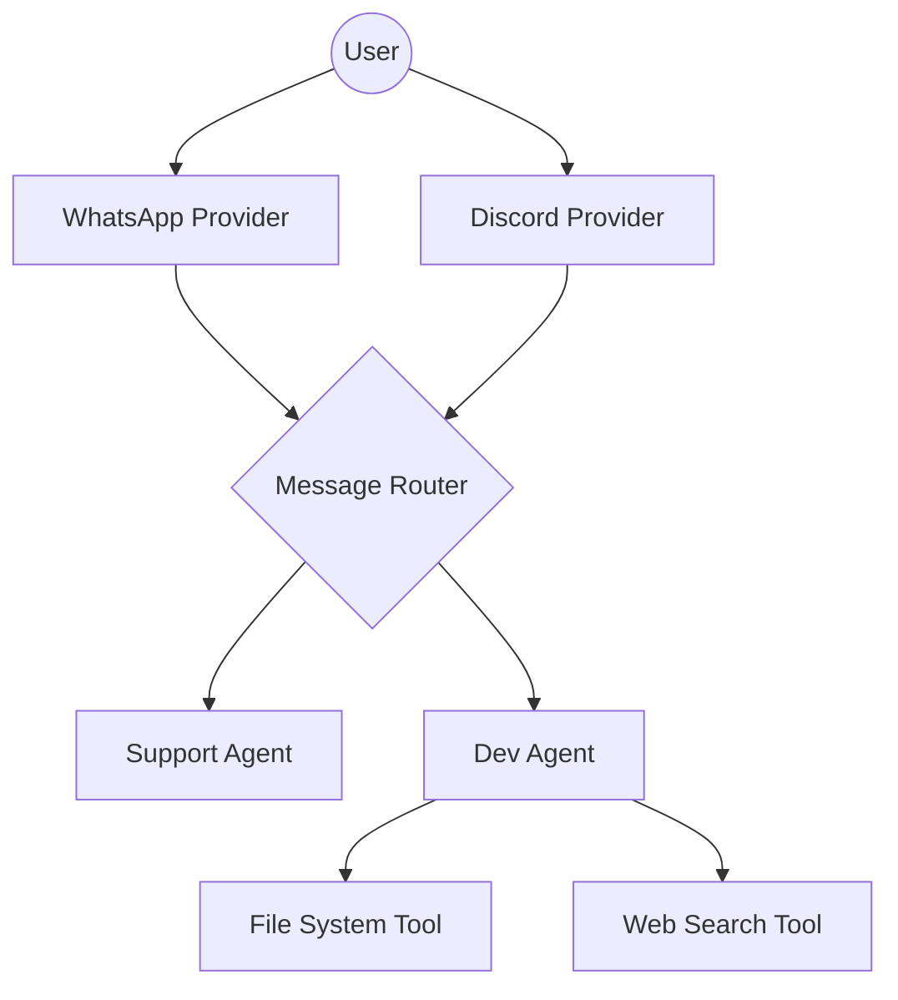

<p align="center">
  
</p>

# @clawreg/core

The ultimate open-source gateway for **AI Agents**. Build, host, and route your agents across **WhatsApp**, **Telegram**, **Discord**, and more with ease.

[](https://www.npmjs.com/package/@clawreg/core)
[](https://opensource.org/licenses/MIT)

## 🚀 Key Features

- **Self-hosted**: Your hardware, your rules. Complete privacy and control.
- **Multi-channel**: One SDK to rule them all. Route messages from WhatsApp, Telegram, Discord, or custom bridges.
- **Agent-Native**: Built-in support for tool-calling, long-term memory, and session management.
- **CLI Wizard**: Powerful onboarding tools to get your gateway running in seconds.

---

## 📦 Installation

```bash
npm install @clawreg/core
```

---

## 🏎️ Quick Start

Create a simple bot that echoes messages on WhatsApp:

```typescript
import { ClawRegClient, WhatsAppProvider } from '@clawreg/core';

const client = new ClawRegClient();

// Connect WhatsApp
const wa = new WhatsAppProvider({ phoneNumber: '123456789' });
client.registerProvider(wa);

// Handle incoming messages
client.onMessage(async (msg) => {
  console.log(`[${msg.channel}] Message from ${msg.sender}: ${msg.text}`);
  await client.send(msg.sender, `You said: ${msg.text}`, msg.channel);
});

await wa.initialize();
```

---

## 🧠 Advanced Usage (Tools & Routing)

ClawReg shines when managing complex AI agents with specialized tools.

```typescript
import { 
  ClawRegClient, 
  MessageRouter, 
  AIAgent, 
  WhatsAppProvider, 
  DiscordProvider,
  FileSystemTool 
} from '@clawreg/core';

// 1. Initialize Client & Router
const client = new ClawRegClient();
const router = new MessageRouter();

// 2. Define an AI Agent with recursive tool-calling capabilities
const devAgent = new AIAgent("Developer", "You are an assistant with access to the file system.");
devAgent.registerTool(FileSystemTool);

// 3. Setup Intelligent Routing
router.registerRoute(/dev|code|fix/i, devAgent);

// 4. Connect Multiple Channels
client.registerProvider(new WhatsAppProvider({ phoneNumber: '62812345678' }));
client.registerProvider(new DiscordProvider({ botToken: 'YOUR_DISCORD_TOKEN' }));

// 5. Unified Message Handling
client.onMessage(async (msg) => {
  const result = await router.handle(msg);
  if (result) {
    await client.send(msg.sender, result.text, msg.channel);
  }
});
```

---

## 🛠️ CLI Tooling

ClawReg comes with a built-in CLI for configuration and daemon management.

```bash
# Start the onboarding wizard
npx clawreg onboard --install-daemon

# Run the gateway server
npx clawreg serve
```

---

## 🗺️ Architecture Overview



## 🏗️ Core Modules

| Module | Description |
| :--- | :--- |
| **Providers** | Specialized adapters that normalize platform-specific data into a standard `AgentMessage`. |
| **Router** | Central steering engine that maintains sessions and routes messages to the right agent. |
| **Agents** | The "brains" - ranging from simple Echo agents to advanced Tool-using AI agents. |
| **Tools/Skills** | A standardized plugin system for autonomous capabilities. See [SKILL.md](skills/SKILL.md). |

---

## 🤝 Contributing

We love contributions! Please read our [Contribution Guide](https://github.com/ClawReg/clawreg/blob/main/CONTRIBUTING.md) to get started.

## 📄 License

ClawReg is MIT licensed. See the [LICENSE](LICENSE) file for more information.

---

<p align="center">
  Built with ❤️ for the Agentic Future by the <b>ClawReg Team</b>.
</p>
